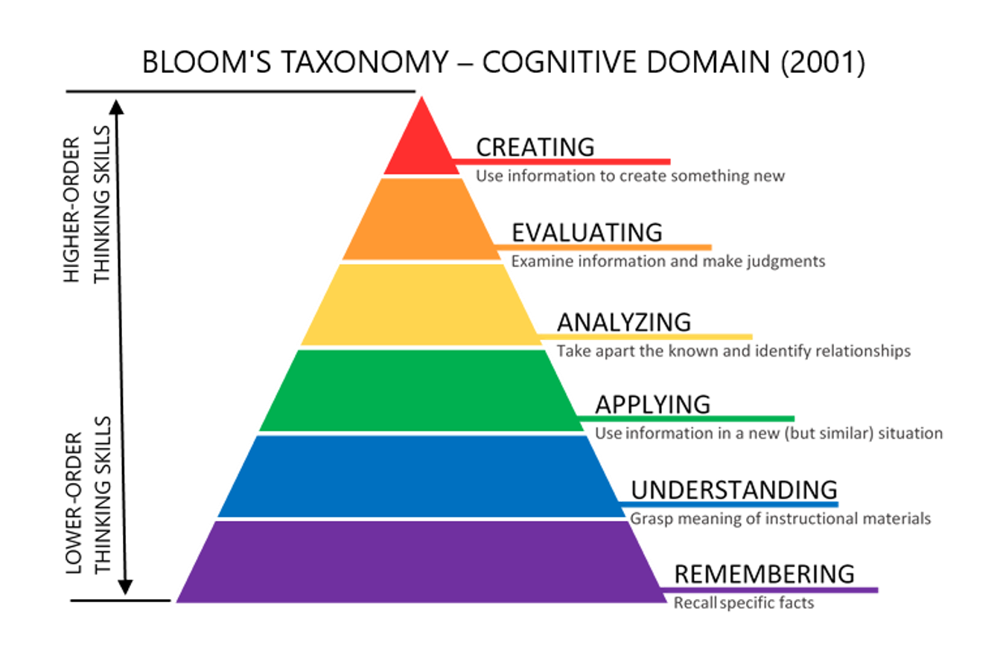
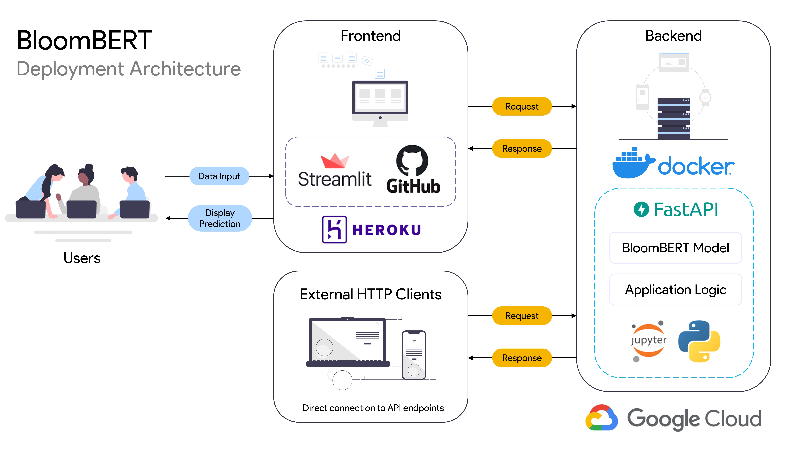

# BloomBERT

_BloomBERT_ is a transformer-based NLP task classifier based on the cognitive domain of the [revised edition of Bloom's Taxonomy](https://en.wikipedia.org/wiki/Bloom%27s_taxonomy). 

Bloom's Taxonomy is a set of hierarchical models used in classifying learning outcomes into levels of complexity and specificity. Although the taxonomy is mostly employed by educators for curriculum and assessment structuring, _BloomBERT_ takes a novel approach in differentiating the difficulty of a task through `classifying productivity related tasks` into the cognitive domain of the taxonomy.

> BloomBERT can be accessed via an API endpoint or a [web application](bloombert.herokuapp.com)

#### Example Outputs:

| Task Description                                                | BloomBERT Classification |
|-----------------------------------------------------------------|--------------------------|
| Programming an automated solution                               | Create                   |
| Preparing for the presentation of findings from market research | Apply                    |
| Reviewing performance metrics for this quarter                  | Evaluate                 |

#### Bloom's Taxonomy:


## Model Overview

BloomBERT was built by fine-tuning a [DistilBERT](https://arxiv.org/abs/1910.01108) model, a lighter version of the original BERT transformer language model
developed by Google. Utilising the pre-trained model, it was trained with a labelled data set curated for the specific task classification.

BloomBERT was developed using `Tensorflow` and the `Hugging Face Transformers library`.
The model incorporates a sequence classification head (linear layer) on top of the DistilBERT pooled outputs and was trained using `Google Colab`.


#### Training Data Distribution:
| Bloom's Level | Count |
|---------------|-------|
| Create        | 430   |
| Evaluate      | 634   |
| Analyse       | 560   |
| Apply         | 671   |
| Understand    | 2348  |
| Remember      | 1532  |
| Total         | 6175  |

```text
Training Results:
    EPOCH: 40 
    training accuracy: 0.9820
    validation accuracy: 0.9109
```

## Deployment Architecture

### Overview:



### Frontend:
Streamlit, Heroku

### Backend:
Docker, FastAPI, Google Cloud Run

## FastAPI Endpoints

#### Request:
`GET` https://bloom-bert-api-dmkyqqzsta-as.a.run.app

#### Response:
```json
{
  "health_check": "OK", 
  "model_version": "1.0"
}
```

#### Request:
`POST` https://bloom-bert-api-dmkyqqzsta-as.a.run.app/predict
```json
{
  "text": "Annotating key points in meeting minutes"
}
```

#### Response:
```json
{
  "blooms_level": "Understand",
  "probabilities": {
    "Analyse": 0.00078,
    "Apply": 0.00075,
    "Create": 0.00054,
    "Evaluate": 0.00051,
    "Remember": 0.00261,
    "Understand": 0.99481
    }
}
```

## Development

## License

